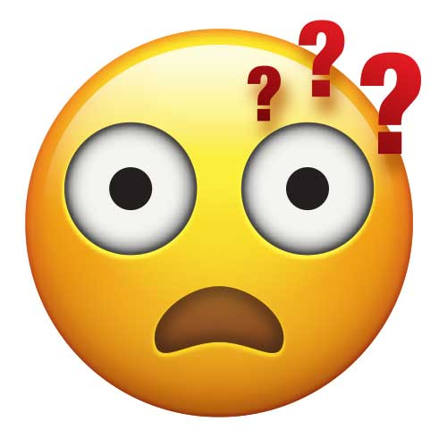

# Welcome to the Internet

**Brief**: To explore handle(s) as an embodied exchange between human and object, in relation to a specific task and for a particular context.

**Audience**: To help new internet users handle online interactions. To remind existing users.

**Disclaimer**: This is not a guide to start using the internet, it's a nudge to be a better internet citizen.

**Technology**: A browser plug-in (add-on) to guide you through online interactions.

## Challenge

People can find interacting with others online a confusing experience. Th

*misunderstanding*
* it is hard to convey a tone
* it 
* People sometimes to not read carefully.
* People are sometimes not aware of a wider context.
* People sometimes to not research the author of whatever they are responding to, so cannot make a judgement on their authority on the subject.

*different language*
* Words mean different things in different context.
* People use images as shorthand (memes).
* People use emojis to signify a tone or feeling.

*unkindness*
* People are sometimes rude online.
* People are sometimes unhelpful online.
* People are sometimes not thoughtful online.

**Scenarios** 
