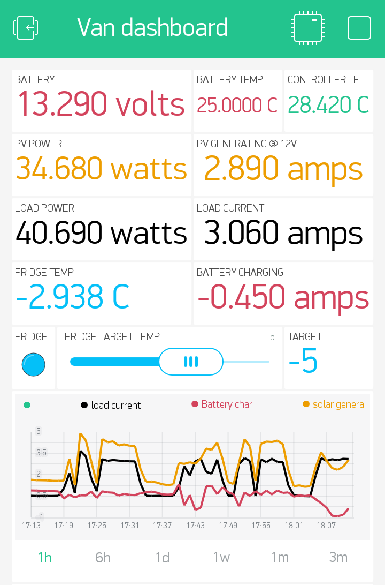

# Rethinking Decentralisation

In late 2016 was invited my Mozilla's OpenIOT Studio to think about Decentralisation, particularly in rural environments.

But first let's start from the basics...

## Who I am and what I'm interested in

I'm a creative technologist. I come from an arts background, I'm self taught techy who has always been interested in how things work. I'm a really good google-until-I-find-the-solution maker.

I believe anyone can make things with technology with the right guides and enough confidence. I spend a lot of my time thinking about this.

I worked within a [technology charity](http://www.raspberrypi.org) over 3 years before going back into the freelance world late 2016 to have the opportunity to take part in projects like this one with Mozilla's OpenIOT Studio. Within this role I got to travel the world attending conferences and festivals where people discussed new technology and the power of making. I also designed and ran workshops, outreach and longer form educational programmes.

I also make tech with [The Pi Hut](http://www.thepihut.com), particularly focusing on making add-on boards for people new to making. Our aim is for our boards to do one thing well.

Before this I ran a Arts and Tech venue in Norwich called Soup Lab.

**Some things I’m generally interested in right now:**
* 
a friendly framework/language to talk about IoT with non-techies
* making IoT things with non-techies
* why/how/is the internet important to people with low/no connectivity
* does IoT widen the divide between those with good connectivity and those without (if so, how do we deal with this?)

**Why?** Because if we want to make tech for everyone, then we need to include them in the progress.

## Talking about IoT & decentralisation

Within this project I will be discussing IoT and decentralisation with people who have no experience of making technology, and perhaps little experience using it.

Before embarking on any project that involves participants of different skills and backgrounds it's useful to reflect on the language we use. Using too much technical jargon in the initial stages of the discussion is a sure-fire way of alienating half your new team. We want to build confidence and skills, so we don't want to dumb down the discussion, but with a little time and effort we can develop a narrative that leaves everyone feeling like they know what's actually being discussed.

*Sidenote: it can also help your technically skilled members of the team be reminded that we are talking about how the technology affects people, rather than the technology itself. Impact rather than solutions.*

**How I develop a narrative within a workshop/discussion.**

Have you watched the The Good Wife? Check out Decision Tree (S05E10). The characters are trying to predict how their opponent (each other) will question/answer in court.

No-one is trying to trick the other into admitting something in our situation, but running what questions might be asked and how you answer them; a balance of giving enough information and context whilst staying on topic and within time constraints is an important skill in managing the narrative within a workshop.

I also think a nice big mental bank of examples is really useful. Try and tailor your examples to the crowd you are talking to - Children and teenagers don't care much about saving money on their central heating.

So let's give it a go with IoT. First to introduce what the Internet of Things is...

> The Internet of things (IoT) is the inter-networking of physical devices … embedded with electronics, software, sensors, actuators, and network connectivity which enable these objects to collect and exchange data.
 - Internet of things, [https://en.wikipedia.org/w/index.php?title=Internet_of_things&oldid=781813467]( https://en.wikipedia.org/w/index.php?title=Internet_of_things&oldid=781813467) (last visited May 23, 2017).

 Makes sense to me, but would be difficult to explain to my grandma. How about we start with...

**Me:** IoT is made up of computers that talk to each other.

**Group:** Why would they need to?

**M:** They can exchange information. They can use that information to make better decisions in whatever they are doing. E.G. if my central heating knows I'm on holiday or late at the office, it can save energy by not turning on until I return.

**G:** How does the computer know I'm on holiday or late?

**M:** These computers generally have inputs and outputs.

An input might be a sensor (it might be able to sense the temperature, or light levels, or pollution in the air) or an input might be information from the internet (like the weather forecast) or information on your phone (like your GPS coordinates).

An output can be almost anything. It can control relays (which act as an on/off switch for any device - like a boiler or a fan or a smoke machine!). The output might be light (a display panel or an LED light) or sound (an annoying buzzer or a song).

> So in this example your phone uses it's GPS sensor to collect your location data, then sends this information through your data plan to a computer in your home on the WIFI. That computer takes that information and runs some code that says "I expect Rachel to be home by 6, but her phone says she is in Hawaii, so I wont turn on my relay controlling the boiler until her phone tells me she is close by."

>**This is usually when participants feel confident to start to think about useful inputs and outputs for themselves.**

This is a very simple example, but I hope it goes some way in showing how we can start discussions about what IoT is with absolutely anyone.

So, the tech savvy among you will notice I left out part of the data's journey in the example above. Rather than my phone talking directly to the computer in my home, it actually talks to a central server *in the cloud* owned by a company that made my boiler's relay***.

 - Daily Mail, September 2014.

This is described as a centralised system, because rather than data going from one device directly to another, it all gets beamed up to a central system to be processed and either collected or acted upon.

I'll talk a bit more about why this is important in the next section.

*** In fact the software system may be owned by a different company, the data might pass through several companies servers before it reaches the hardware. 

### Decentralisation

When we discuss decentralisation within IoT, we're often talking about:
* Advocating for an alternative to all IoT services to be run (and data collected) by a few big companies.
* Security, transparency and data ownership.
* Local networks.

These are closely intertwined concerns within the IoT community at the moment. It's worth noting these are issues that are still hotly debated about the world wide web, let alone IoT which is a much younger technology. I certainly don't claim to have any definitive solutions, but let's examine these issues a little closer.

#### All IoT services run by a few big companies.
 So, why would this be a problem? Well..
 * Lack of transparency. Everyone has experienced (i.e. ignored and accepted) the terms and conditions on services we use. Even when you do read them, it's often technical and legal jargon making it unclear what these companies actually do with your information.
 * If the service is down you may be left without the use of vital services in your home.
 * Redundant hardware. If the company goes out or business or is sold, or a even just the product discontinued you may end up with hardware that no longer functions correctly.
 * Brand lock-in. These companies may make hardware that will only talk with other products made by them.
 * **You need to be connected to the World Wide Web.**

For balance, some advantages big companies have:
 * Security, you would hope they would have the money and expertise to make sure your data is safe. More on this later.
 * Money for product innovation.
 * Money for advertising and public education.

Often people will understandably feel that they have no choice but choose products made by the big companies. However, when we spend money or time, we are not only buying a product, but we are supporting a company. We can ask companies to change products and practices, and we can stop buying from them if they don't.

I invite people to think about [seed banks](https://en.wikipedia.org/wiki/Seed_bank) (bare with me). In the last 50 years crop diversity has massively diminished, genetic diversity within each crop (fewer strains) and the number of different species grown. All over the globe we have facilities where every strain of seed is carefully stored. We store them because if a virus, disease or climate change were to wipe out a particular species of crop, then we have an alternative strain we can try. But in the meantime we would face unimaginable food shortages. We should promote diversity in our crops, because circumstances do change.

Within the IoT ecosystem we may head towards a similar situation. Where a few major companies control the majority of the IoT in our homes and cities. Unfortunately there is no seed bank equivalent for IoT services, we can't just germinate another if ours catastrophically fail (through virus, human error, natural disaster, ?). So we must make sure we support a wide range of companies now. Diversity is important.

#### Security, transparency and data ownership.

Security - I will be brief, because there is so much information on internet and IoT security failures. Simply, if we built primarily decentralised systems, not as much of our data would need to be stored on servers out of our control.
I will share two links which should be enough to freak you out:
* [haveibeenpwned.com](https://haveibeenpwned.com/) to see if any of your account details have been compromised in any major security breach.
* [http://www.insecam.org/](http://www.insecam.org/) a large directory of insecure public webcams. These haven't been hacked, they have been left insecure by the manufacturers.

Data ownership

Transparency

#### Local Networks

A local network is a network of computers. AN internet, not THE internet.

## ATLIN

 

## Isle of Lewis

 - opensignal.com

## Discovering vanlife

## Next Steps

Since returning I have reconsidered how I frame decentralisation and how I might be able to reach communities that don't often get invited to think about how the internet and IoT may be beneficial for them.

Part of this will be building a tiny IoT home on wheels. This means I can have discussions with people anywhere about how IoT within their own home could benefit them, whilst promoting ethical IoT, and perhaps more knowledge to be able to understand what IoT they are buying.

And ideally I'd like people starting to make their own hardware, so the biggest part of my next steps is documenting each step of my Tiny IoT home build, see more below.

## Rethinking Decentralisation

This isn't a new idea. Library buses (or Bookmobiles) have been touring rural areas in the UK [since 1857](https://en.wikipedia.org/wiki/Bookmobile#19th_century)!

We talk a lot about how the internet means we can work from anywhere, but more often than not 'anywhere' means anywhere in cites or in our homes. Perhaps it is time to start thinking about internet, IoT and homes that can move.

## Open Hardware

A quick overview of what Open Hardware is, and how my building and documenting works.

I will be updating build sections as I go. Some of be very focused on IoT (e.g. hacked Solar Monitor, and IoT Fridge) and some wont have any (cutting list for the cabinets).

A lot of what I will be documenting I wont have worked out on totally my own. Much of the software will have been based on projects which already exist and I may have been signposted to particular bits of hardware by others who have tried out things before me. One of the major joys of the internet is the mass exchange of knowledge, we no longer have to reinvent the wheel over and over. Knowing how to search through and digest massive amounts of information is now a more daunting task than finding it in the first place. I will endeavour to link back to original sources whenever I am able and will try and remember to explain *how* I found information too.
